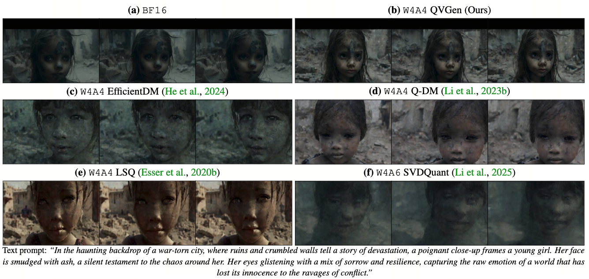
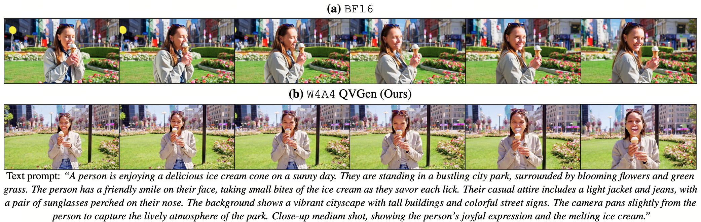

<div align="center" style="font-family: charter;">
<h1> QVGen:<br> Pushing the Limit of Quantized Video Generative Models</h1>

[](https://opensource.org/licenses/Apache-2.0)&nbsp;
[](https://arxiv.org/pdf/2505.11497)&nbsp;
[](https://github.com/ModelTC/QVGen)&nbsp;
[](https://huggingface.co/collections/Harahan/qvgen)&nbsp;

**[ [Conference Paper](https://arxiv.org/abs/2505.11497) | [Models](https://huggingface.co/collections/Harahan/qvgen) | [Dataset](https://huggingface.co/datasets/nkp37/OpenVid-1M) ]**

[Yushi Huang](https://Harahan.github.io), [Ruihao Gong📧](https://xhplus.github.io/), [Jing Liu](https://jing-liu.com/), [Yifu Ding](https://yifu-ding.github.io/), [Chengtao Lv](https://scholar.google.com/citations?user=r8vseSUAAAAJ&hl=en), [Haotong Qin](https://htqin.github.io/), [Jun Zhang📧](https://eejzhang.people.ust.hk/)

(📧 denotes corresponding author.)

</div>


This is the official implementation of our paper [QVGen](https://arxiv.org/abs/2505.11497). It is *the first* to reach full-precision comparable quality under 4-bit settings and it significantly outperforms existing methods. For instance, our 3-bit CogVideoX-2B improves Dynamic Degree by +25.28 and Scene Consistency by +8.43 on VBench.

## :fire: News

* **Jan 31, 2026**: 🔥 We release our Python code and checkpoints for QVGen presented in our paper. Have a try!

* **Jan 23, 2026**: 🌟 Our paper has been accepted by ICLR 2026! 🎉 Cheers!

## 🎬 Visual Examples

<div align="center">
  
  <br/>
  
  <p><small>Comparison of samples from 4-bit per-channel weight and per-token activation quantized CogVideoX-2B (upper) and Wan 14B (lower), across different methods.</small></p>
</div>

## 📖 Overview

<div align="center" style="font-family: charter;">


<h align="justify"><strong>Overview pipeline of the proposed QVGen.</strong> (a) This framework integrates auxiliary modules $\Phi$ to improve training convergence. (b) To maintain performance while eliminating inference overhead induced by $\Phi$, we design a <i>rank-decay</i> schedule that progressively shrinks the entire $\Phi$ to $\varnothing$ through <i>iteratively applying</i> the following two strategies: (<i>i</i>) SVD to identify the low-impact components in $\Phi$; (<i>ii</i>) A rank-based regularization $\mathbf{\gamma}$ to decay the identified components to $\varnothing$.
</h>

</div> 

## ✨ Quick Start

After cloning the repository, follow these steps to train and run inference. We use Wan 1.3B as the example (the same workflow applies to CogVideoX 2B).

### Requirements

Install dependencies with `pip install -r requirements.txt`. For quantization, we use 8x H100/H800/A100/A800 GPUs; otherwise, adjust the scripts accordingly.

### Prepare data and models

Download the pretrained [Wan2.1 1.3B](https://huggingface.co/Wan-AI/Wan2.1-T2V-1.3B-Diffusers) to `models/Wan2.1-T2V-1.3B-Diffusers`, then prepare the dataset:

```shell
# download and preprocess data
python prepare_dataset/download.py --output_directory dataset
sh script/data/prepare_dataset_wan_1-3b.sh
```

Note: please replace any `path/to/your/...` placeholders in the scripts with your local paths.

We also provide quantized checkpoints on Hugging Face:

| Model | #Bit |
| --- | --- |
| [Wan 1.3B](https://huggingface.co/Harahan/QVGen-Wan-1_3B-W4A4) | W4A4 |
| [CogVideoX-2B](https://huggingface.co/Harahan/QVGen-CogVideoX-2B-W4A4) | W4A4 |

### Training

Below is an example training command. For more details, please refer to the paper.

```shell
sh script/train/w4a4_wan_1-3b.sh
```

### Inference

Here is the corresponding inference command.

```shell
# You can also set the path to a pre-downloaded quantized checkpoint in the script.
sh script/inference/w4a4_wan_1-3b.sh
```

### Evaluation

We recommend using our inference code and following the steps in [VBench](https://github.com/Vchitect/VBench). For evaluation, you can also refer to our distributed inference scripts for video generation: `inference/ddp_cogvideox_t2v.py` and `inference/ddp_wan_t2v.py`.

## 💪 TODO

The codebase has not been fully cleaned for public release yet.
We will continue to clean and refine it in subsequent updates.

- [ ] Training and inference code for large models (*e.g.*, Wan 14B, CogVideoX 5B).
- [ ] More quantized checkpoints.
- [ ] More efficient training code.

## 🤝 Acknowledgments

Our code is built on the open-source [finetrainers](https://github.com/huggingface/finetrainers/tree/main).

## ✏️ Citation

If you find QVGen useful, please cite our paper:

```
@inproceedings{huang2026qvgenpushinglimitquantized,
  title={QVGen: Pushing the Limit of Quantized Video Generative Models}, 
  author={Yushi Huang and Ruihao Gong and Jing Liu and Yifu Ding and Chengtao Lv and Haotong Qin and Jun Zhang},
  booktitle={International Conference on Learning Representations},
  year={2026},
  url={https://arxiv.org/abs/2505.11497}, 
}
```
